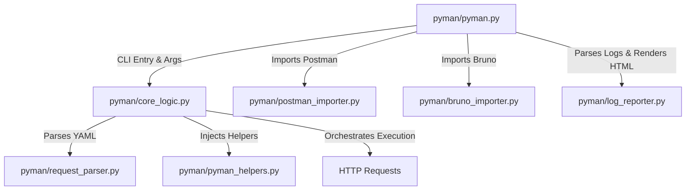

# Gemini Project Memories: PyMan

PyMan is a lightweight, filesystem-based HTTP request runner CLI. It allows executing API request collections defined in YAML files, supporting pre/post-run scripts (Python), environment variables, custom execution orders, HTML reporting, and automated importers for Postman (v2.1) and Bruno collections.

---

## 🏗️ Architecture & Component Mapping

The codebase is organized under a modular package structure in the `pyman` subdirectory. Here is how components relate:



### Key Modules

1. **`pyman/pyman.py`**:
   - **Role**: Command Line Interface entry point (`main()`).
   - **Commands**:
     - `run <target>`: Runs a collection (directory) or a single request (`.yaml` file).
     - `import-postman -c <path> -o <out>`: Imports a Postman v2.1 collection.
     - `import-bruno -c <path> -o <out>`: Imports a Bruno collection.
   - **Key Options**:
     - `--no-report`: Disables HTML report generation.
     - `--collection-order <order_name>`: Executes requests in a custom order defined in the collection's `config.yaml`.
     - `--force-env`: Forces overwriting `.environment-variables` with `.environment-variables-template`.

2. **`pyman/core_logic.py`**:
   - **Role**: Execution engine and orchestrator.
   - **Flow of execution**:
     1. Loads collection configuration (`config.yaml`) and metadata.
     2. Sets up logging (to console with ANSI colors and to file inside `logs/`).
     3. Instantiates `PyManHelpers` (the `pm` object).
     4. Loads environment variables from `.environment-variables`.
     5. Runs `collection-pre-script.py` if present.
     6. Loops through request files (by custom execution order or default alphabetical order):
        - Loads folder-specific `config.yaml` to merge folder variables.
        - Parses request YAML (`request_parser.py`).
        - Runs request-level `*-pre-script.py`.
        - Performs variable substitution in URL, parameters, headers, auth, and body.
        - Sends the HTTP request via `requests`.
        - Runs request-level `*-pos-script.py` (has access to `response`).
        - Automatically tests HTTP status codes if no post-script is present.
     7. Runs `collection-pos-script.py`.
     8. Generates a JSON report (`logs/report_<collection>_<timestamp>.json`).
     9. Triggers HTML report generation if enabled.
   - **Environment Persistence**: Any changes made by pre/post scripts to the `environment_vars` dictionary are automatically saved back to the `.environment-variables` file.

3. **`pyman/pyman_helpers.py`**:
   - **Role**: Defines the `PyManHelpers` class (bound to the `pm` global variable inside scripts).
   - **Available Helpers**:
     - `pm.test(test_name, test_func)`: Assertion runner (similar to Postman's `pm.test`).
     - `pm.timestamp()`: Returns current Unix epoch timestamp.
     - `pm.random_int(min, max)`: Generates a random integer.
     - `pm.random_choice(*choices)`: Picks a random element.
     - `pm.random_chars(length, charset)`: Generates a random alphanumeric string.
     - `pm.random_password(length)`: Generates a secure random password.
     - `pm.random_adjective()`, `pm.random_noun()`, `pm.random_music_genre()`: Returns localized dummy strings.
     - `pm.random_uuid()`: Generates a version 4 UUID.

4. **`pyman/request_parser.py`**:
   - **Role**: Reads request YAML files and outputs standard dictionaries containing standard HTTP fields: `method`, `url`, `params`, `auth`, `headers`, `body`, and `pre-requests`.

5. **`pyman/log_reporter.py`**:
   - **Role**: Parses log files to extract metadata, run statistics, execution outcomes, and renders a fully responsive HTML report saved in a `reports/` folder.

6. **`pyman/postman_importer.py` & `pyman/bruno_importer.py`**:
   - **Role**: Converters mapping requests and folder configurations from Bruno/Postman schemas to PyMan directory layout and YAML requests.
   - **Script conversion**: Attempt basic conversion of simple Javascript patterns (e.g., `pm.environment.set`) to Python statements; complex scripts are enclosed in multi-line comments with a `TODO` for manual adjustment.

---

## 🔍 Code Insights & Discovered Quirks

During analysis, the following structural limitations and minor bugs were observed:

### 1. Request Chaining (`pre-requests`) (Fixed)
- **Context**: The `README.md` documents request chaining via a `pre-requests` list inside request YAML files:
  ```yaml
  pre-requests:
    - ../auth/login.yaml
  ```
- **Code Status**: Chained requests are now fully implemented and supported recursively inside `core_logic.py`. Circular dependencies are tracked and prevented via execution path checking. Shared state/variables from chained pre-requests carry over to succeeding requests.

### 2. Auto-invoking Helper Methods & `pm.iso_timestamp` (Fixed)
- **Context**: Example requests (`patch-data.yaml` and `post-xml-request.yaml`) use `{{pm.iso_timestamp}}`, and some use methods like `{{pm.random_noun}}` without parentheses.
- **Code Status**:
  - `pm.iso_timestamp()` has been successfully added to `pyman_helpers.py`.
  - The variable substitution in `core_logic.py` has been updated to automatically call helper methods if referenced without parentheses, resolving the `X-Random-Adjective` and `title` output errors (which previously resolved to `<bound method...>` in logs).

### 3. Execution Script Environment Context
- Scripts executed in pre/post hooks are evaluated using Python's `exec()`. They share a `shared` object instance (across the collection run) and receive global access to `pm`, `environment_vars`, `response` (post-scripts only), `log`, `requests`, `json`, `os`, `re`, and `time`.

### 4. Modernized Terminal Output Formatter (Implemented)
- **Context**: The terminal outputs were verbose and filled with raw absolute paths.
- **Code Status**: Added an enhanced console `ColorFormatter` in `core_logic.py` that outputs clean emojis, relative files, request methods, green/yellow/red HTTP statuses, and a beautiful ASCII execution summary table. The raw log format remains unchanged for file writing to ensure reports generated by `log_reporter.py` do not break.

---

## 🛠️ Development & Running Collection

To validate changes locally:

1. **Activate virtual environment**:
   ```bash
   source venv/bin/activate
   ```
2. **Install dependencies**:
   ```bash
   pip install -r requirements.txt
   ```
3. **Execute example collection**:
   ```bash
   python -m pyman.pyman run examples/pyman_collection
   ```
4. **Editable install**:
   ```bash
   pip install -e .
   ```
